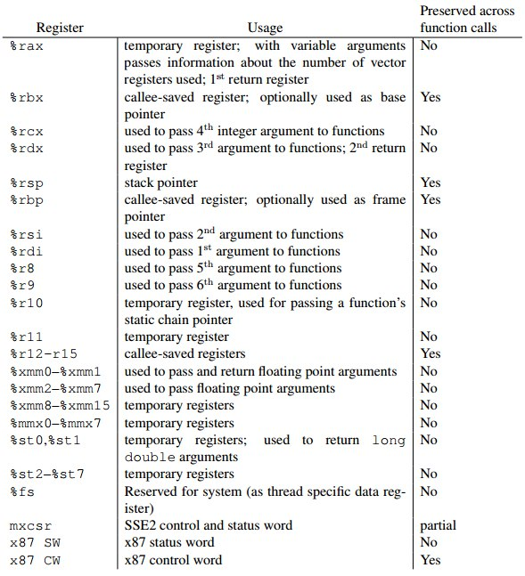

Полезный плагин для отладки через gdb: [peda](https://github.com/longld/peda).
Установка:
```
git clone https://github.com/longld/peda.git ~/peda
echo "source ~/peda/peda.py" >> ~/.gdbinit
echo "set disassembly-flavor att" >> ~/.gdbinit
echo "DONE! debug your program with gdb and enjoy"
```

Calling convention для x86 ассемблера:


